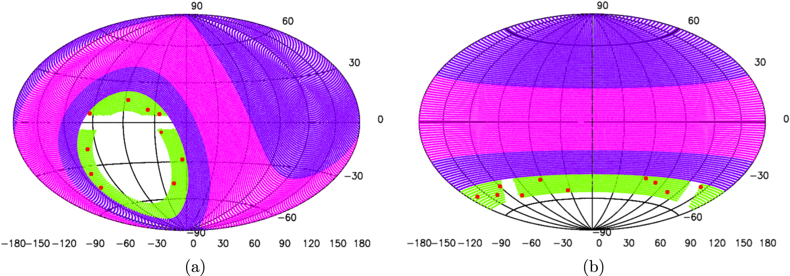

# The GHRSS FFA Pipeline

![License][license]
[![GHRSS Paper 1][ghrss-1-badge]][ghrss-1]
[![GHRSS Paper 2][ghrss-2-badge]][ghrss-2]

## Contents

[**Citation**](#citation) 
[**Sky Coverage**](#sky-coverage) 
[**Directories**](#directories) 
[**Scripts**](#scripts) 
[**Dependencies**](#dependencies )
[**Notes**](#notes) 

This is the code being used to analyse data obtained from the [**G**iant **M**eterwave **R**adio **T**elescope (**GMRT**)][gmrt] as part of the **G**MRT **H**igh **R**esolution **S**outhern **S**ky (**GHRSS**) survey. The **GHRSS** survey has discovered <NEWPSRS> new pulsars and <NEWRRATS> new RRATs till date. A thorough overview of the survey patameters and design can be found [**here**][ghrss-1], and additional results can be found [**here**][ghrss-2]. I wrote this code in 2019 as part of my thesis project for my Bachelor's degree. It is written in pure Python, but it depends on the [**PRESTO**][presto] package for some of its processing capabilities (such as dedispersion and folding). This pipeline uses [**riptide**][riptide], an FFA implementation written by Vincent Morello at the University of Manchester.

## Citation

On the way 😁 !

## Sky Coverage

  

  

(a) Sky coverage in Galactic coordinates of recent and ongoing pulsar surveys around 300 MHz; GBT drift scan (pink) at 350 MHz, GBNCC (purple) at 350 MHz, and GHRSS (green) at 322 MHz. Red dots are the pulsars discovered with the GHRSS survey. (b) Sky coverage in right ascension and declination. Taken from [here][ghrss-1].

## Directories

There are 4 main directories:

1. `configurations`: This directory stores the configurations for the pipeline. The [`ghrss_config.yaml`](./configurations/ghrss_config.yaml) contains the configuration for the main pipeline, whereas the [`ffa_config`](../configurations/ffa_config) directory contains the configurations for the different parameter spaces searched for by **riptide**. There is a [`manager_config.yaml`](./configurations/ffa_config/manager_config.yaml) that stores the overall configuration for riptide, and then there are 4 different files for each different period space searched by our FFA pipeline:

    * [`config_short.yaml`](./configurations/ffa_config/config_short.yaml)
    * [`config_mediium.yaml`](./configurations/ffa_config/config_medium.yaml)
    * [`config_long.yaml`](./configurations/ffa_config/config_long.yaml)
    * [`config_longer.yaml`](./configurations/ffa_config/config_longer.yaml)

2. `sources`: This directory stores the coordinates for all pointings that are observed as part of the GHRSS survey. These, along with the associated timestamp files, are used by the pipeline to construct the metadata for each raw file. There are two source lists: [`ghrss.1.list`](./sources/ghrss.1.list) and [`ghrss.2.list`](./sources/ghrss.2.list).

3. `preprocessing`: This directory stores configuration parameters for certain preprocessing scripts that are used by this pipeline, such as [**GPTooL**][gptool]. **GPTool** is primarily used for RFI mitigation (in *both* frequency and time domains). It reads the configuration variables from the corresponding `gptool.in` files for each backend (see the note on [**backends**](#notes)), stored in their corresponding sub-directories here.

4. `src_scripts`: This is where the main processing code resides. The primary purpose of this code is *automation*. It runs the necesssary Python functions/scripts and shell commands for each step, and ensures that each process waits for the previous one to finish. It also uses a simple mechanism that allows the pipeline to restart from where it left off, in case of a crash.

## Scripts

Depending on how you want to run the pipeline, you can either of two scripts:

* The [`single_config.py`](./single_config.py) runs the pipeline on a single machine. If your machine has multiple cores, you can get a speedup by specifying the number of cores you want to use in the [`ghrss_config.yaml`](./configurations/ghrss_config.yaml) file.

* The [`multi_config.py`](./multi_config.py) file. Originally, this script was intended for automating the run of the pipeline on multiple machines. However, I could not get a framework like **paramiko** to work at the time (for automating the login into each of the nodes and setting up the conda environment). This file is no diffferent from the [`single_config.py`](./single_config.py) in any way, except for the extra `node` argument.

The pipeline's run can be monitored using the [`the_monitor.py`](./the_monitor.py) script. This uses the `curses` library to construct a simple terminal user interface, where you can see both the state of the current run of the pipeline, as well as the files it has already processed. It uses the logs produced by the pipeline, as well as file system information, to do this.

## Dependencies

The pipeline relies on the following Python packages:

* pytz
* yaml
* numpy
* pprint
* astropy
* riptide
* matplotlib

The best way to ensure that all these dependencies are present on your machine is to use a [*conda environment*][conda]. The [`the_monitor.py`](./the_monitor.py) script relies on the `curses` package in the Python standard library, which in turn depends on the `ncurses` backend. This implies that this particular script may not run on a Windows system. If you find a bug  in the pipeline or have any issues in running it on your system, let me know in the [**issues**][issues] 😁 👍 !

## Notes

1. There are two backends in use at **GMRT**: the **G**MRT **S**oftware **B**ackend (**GSB**) and the **G**MRT **W**ideband **B**ackend (**GWB**). As their names indicate, the former is *narrowband*, while the latter is *wideband* (installed as a part of the **upgraded** GMRT, a.k.a. uGMRT). The scripts in this repository work with data from both backends. The following table lists out some of the relevant parameters for each backend:

    

    |     |       Bandwidth      |    Sampling Time   | Center Frequency |
    | --- | -------------------- | ------------------ | ---------------- |
    | GSB |   8, 16 or 32 MHz    | 61.44 microseconds |     336 MHz      |
    | GWB | 100, 200, or 400 MHz | 81.92 microseconds |     400 MHz      |

    

2. This pipeline uses an old version of **riptide** (v0.0.1, to be precise 😅). The code here *may* work with `v0.0.2` and `v0.0.3`, but they definitely would not work with any of the newer versions (`v0.1.0` and beyond) because of a massive refactor of the entire codebase. A version of the pipeline that works with newer versions of the pipeline is in the works 🔨.

[cite]: https://todo.fixme
[cite-badge]: https://todo.fixme
[gmrt]: http://gmrt.ncra.tifr.res.in
[conda]: https://docs.conda.io/en/latest
[ghrss-1]: https://arxiv.org/abs/1509.07177
[ghrss-2]: https://arxiv.org/abs/1906.09574
[presto]: https://github.com/scottransom/presto
[riptide]: https://github.com/v-morello/riptide
[gptool]: https://github.com/chowdhuryaditya/gptool
[issues]: https://github.com/astrogewgaw/ghrss-ffa/issues
[license]: https://img.shields.io/github/license/astrogewgaw/ghrss?style=for-the-badge
[ghrss-1-badge]: https://img.shields.io/badge/arXiv-1509.07177-B31B1B.svg?style=for-the-badge
[ghrss-2-badge]: https://img.shields.io/badge/arXiv-1906.09574-B31B1B.svg?style=for-the-badge
